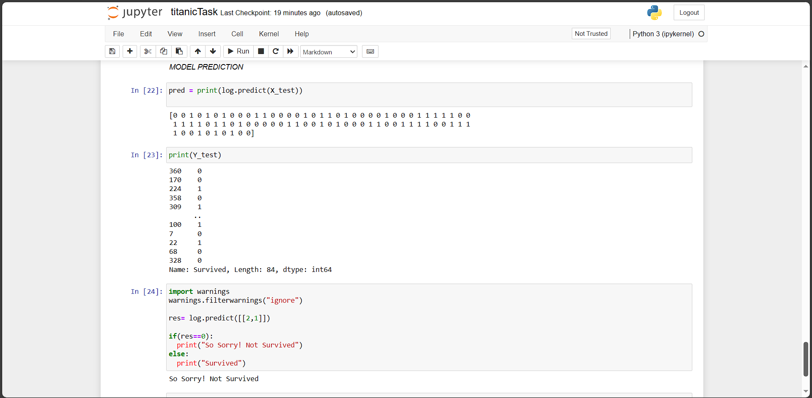

# titanic-Survival-Prediction

In this project we are trying to predict the survival probablity/chance of passengeners on titanic. Here we have used Logistic Regression as a part of linear model to classify whether a particular person will survive or not. Logistic Regression offers logrithms fitting ability to fit the data points from dataset in much better way.
We have used classic titatic survivor dataset from kaggle.

